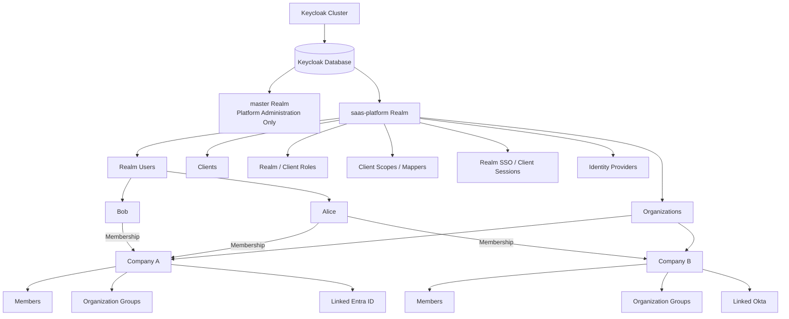
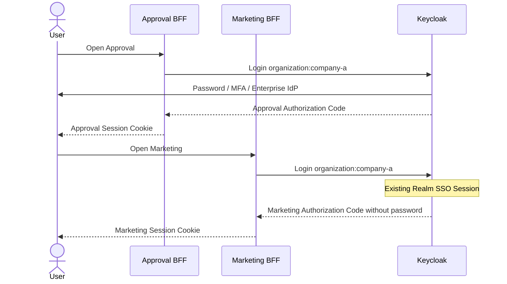
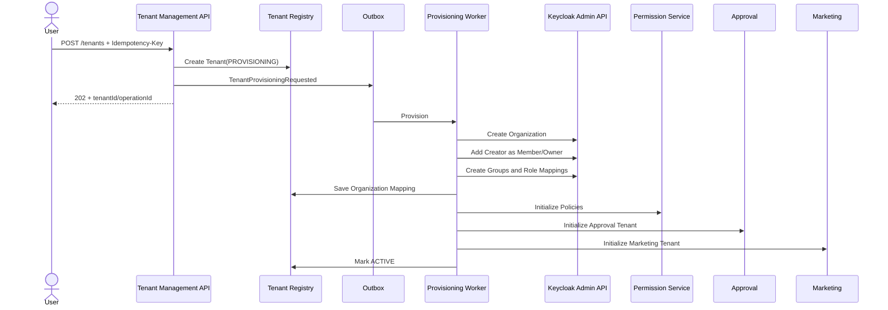

# Keycloak SaaS 多租户结构与自动 Provisioning 设计

> 专项范围：Keycloak Realm、Organization、User、Group、Client、Role、SSO、企业 IdP 与 Tenant Provisioning
> 配套总架构：[SaaS 统一身份、SSO、多租户与细粒度授权架构设计](./saas-iam-authorization-architecture.md)
> 日期：2026-08-17

## 1. 最终决策

本平台采用：

```text
一个 Keycloak Cluster
└── 一个 Keycloak Database
    ├── master Realm（只用于平台管理）
    └── saas-platform Realm（SaaS 用户与应用）
        ├── Organization: company-a
        ├── Organization: company-b
        └── Organization: company-c
```

核心含义：

```text
Realm        = 整个 SaaS 身份边界
Organization = 一个 SaaS Tenant 的 IAM 表示
Realm User   = 平台级唯一身份
Membership   = User 属于哪个 Tenant
Client       = Approval、Marketing 等应用/服务
Client Role  = 稳定的应用权限
Realm Session = 跨应用 SSO 基础
```

Realm 不是 Database，Organization 也不是 Database。默认多个 Realm 和 Organization 都由同一个 Keycloak Database 保存，并由 Keycloak 自己管理。

## 2. Keycloak 完整层级



展开结构：

```text
Keycloak Cluster
├── Keycloak DB
├── master Realm
│   └── Keycloak Platform Administrators
└── saas-platform Realm
    ├── Realm Users
    │   ├── Alice
    │   ├── Bob
    │   └── Charlie
    ├── Organizations
    │   ├── Company A
    │   │   ├── Alias / Domain / Attributes
    │   │   ├── Members: Alice, Bob
    │   │   ├── Groups
    │   │   │   ├── /Owners
    │   │   │   ├── /Admins
    │   │   │   ├── /Finance
    │   │   │   └── /Marketing
    │   │   └── Linked IdP: Company A Entra ID
    │   └── Company B
    │       ├── Members: Alice, Charlie
    │       ├── Groups
    │       └── Linked IdP: Company B Okta
    ├── Clients
    │   ├── approval-web / approval-api / approval-service
    │   ├── marketing-web / marketing-api / marketing-service
    │   ├── permission-service
    │   └── tenant-management
    ├── Client Roles / Composite Roles
    ├── organization Client Scope / Mappers
    ├── Realm SSO Sessions
    └── Client Sessions
```

## 3. Database、Realm 与 Organization 的区别

| 层级 | 含义 | 隔离类型 |
|---|---|---|
| Keycloak Database | Keycloak 底层持久化 | 物理数据库边界 |
| Realm | 用户、Client、Role、Session 的逻辑安全边界 | 强逻辑隔离 |
| Organization | 一个 Realm 内的 B2B/SaaS Tenant IAM 上下文 | Tenant 逻辑隔离 |
| Group | Organization 内部门/团队层级 | 组织结构隔离 |

一个 Realm 不自动对应一个独立数据库。Realm-per-Tenant 仍可能共享同一 Keycloak DB；真正数据库隔离需要独立 Keycloak Deployment/Database。

普通 B2B SaaS：

```text
One Realm + Organization per Tenant
```

强监管客户可采用混合模式：

```text
普通客户 → 共享 SaaS Keycloak/DB/Realm，以 Organization 隔离
特殊客户 → 独立 Keycloak Deployment + 独立 DB
```

## 4. User 存储与 Membership

### 4.1 User 是 Realm-level

用户不是复制到每个 Organization：

```text
Realm User: Alice
├── Membership → Company A
└── Membership → Company B
```

同一个 Alice 只有一个 Realm `sub`，但在不同 Organization 可以有不同 Group 和 Role。

### 4.2 Keycloak 本地用户

Keycloak 保存：

```text
User ID / sub
Username / Email
Profile Attributes
Password Credential
MFA Credential
Organization Membership
Organization Group Membership
Role Mapping
```

密码和 MFA 不复制到 Approval、Marketing、Permission DB。

### 4.3 企业 IdP 用户

Company A 使用 Entra ID 时：

```text
Alice → Company A Entra ID → Keycloak Broker → SaaS Applications
```

职责：

```text
Entra ID：密码、企业账号、上游 MFA
Keycloak：Broker User、Federated Identity Link、Organization Membership、平台 Token
```

下游始终只信任 Keycloak Issuer，无需分别支持每个客户 IdP。

### 4.4 业务用户投影

Tenant Management 可以保留轻量业务投影：

```sql
CREATE TABLE platform_user (
    subject_id VARCHAR(200) PRIMARY KEY,
    display_name VARCHAR(200),
    email VARCHAR(320),
    status VARCHAR(30),
    created_at TIMESTAMPTZ NOT NULL
);

CREATE TABLE tenant_member (
    tenant_id UUID NOT NULL,
    subject_id VARCHAR(200) NOT NULL,
    employee_number VARCHAR(100),
    department_id UUID,
    job_title VARCHAR(200),
    business_status VARCHAR(30),
    PRIMARY KEY (tenant_id, subject_id)
);
```

```text
Keycloak Membership：Alice 是否能以 Company A 身份登录
tenant_member：Alice 在 Company A 的员工编号、部门、职位和业务状态
```

业务投影不保存密码、MFA Secret、Refresh Token 或 Keycloak Credential。

### 4.5 密码与 Credential 存储模式

密码存在哪里取决于 User 的身份来源。Approval、Marketing、Permission Service 和 Tenant Management 都不保存用户密码。

#### Keycloak 本地用户

如果用户不是企业 IdP、LDAP 或 Active Directory 用户，密码由 Keycloak 管理：

```text
User
→ Keycloak Login Page
→ Keycloak Password Validation
→ Keycloak Database
```

Keycloak Database 保存的是 Credential 记录，而不是明文密码：

```text
Password Hash
Salt
Hash Algorithm
Algorithm Parameters
Credential Metadata
```

当前非 FIPS 部署默认使用 Argon2；FIPS 部署默认使用 `PBKDF2-SHA512`。密码哈希是单向的，管理员不能解密或显示原密码；忘记密码时只能执行 Reset。

简化示例：

```text
algorithm: argon2id
hash: <one-way hash>
salt: <random salt>
iterations: 5
memory: 7168 KB
parallelism: 1
```

#### LDAP / Active Directory 用户

```text
User
→ Keycloak
→ LDAP / Active Directory
```

密码保存在 LDAP/AD。Keycloak 可以同步或导入用户 Profile，但不会导入 LDAP 密码；登录时密码验证始终由 LDAP/AD 完成。LDAP 的 Hash、Salt 和 Password Policy 由对应目录服务负责。

#### 企业 OIDC / SAML IdP 用户

```text
User
→ Keycloak
→ Entra ID / Okta / Customer IdP
```

密码、上游 MFA 和企业账号生命周期保存在客户 IdP。Keycloak 只保存 Broker User、Federated Identity Link、Organization Membership、Group/Role Mapping 和平台 Session，不保存客户 IdP 密码。

#### 存储位置总结

| 用户类型 | 密码存储/验证位置 | Keycloak 保存 |
|---|---|---|
| Keycloak 本地用户 | Keycloak DB 中的加盐 Password Hash | User、Credential、MFA、Membership |
| LDAP/AD 用户 | 客户 LDAP/AD | User/Profile 映射及 Keycloak 扩展数据；不导入密码 |
| OIDC/SAML 企业 IdP 用户 | Entra ID、Okta 或客户 IdP | Broker User、Federated Identity Link、Membership |

#### Keycloak Database 安全要求

Keycloak DB 除了 Password Hash，还可能包含 Client Credential、Realm Signing Key、Session 和 MFA Credential，因此仍属于高敏感数据：

- 使用独立 Keycloak Database 和最小权限数据库账号。
- 不允许 Approval、Marketing、Permission Service 直接连接。
- 启用数据库静态加密/TDE 和加密备份。
- 数据库密码存 Vault/Secret Manager，不写入 Git 或普通配置文件。
- 限制网络访问，启用审计，并定期进行恢复演练。
- 日志不得记录密码、Password Hash、Token、Client Secret 或 Realm Key。

密码策略应在 Realm 建立初期确定；后续改变 Hash Algorithm 时，已有 Hash 通常会在用户下一次成功登录/更新密码后逐步迁移。

## 5. Organization 结构

每个 Organization 包含：

```text
Organization ID
Alias
Display Name
Enabled Status
Domains
Attributes
Members
Organization Groups
Linked Identity Provider
```

示例：

```text
Company A
├── id: kc-org-company-a
├── alias: company-a
├── domain: company-a.com
├── attributes
│   ├── plan: enterprise
│   └── region: malaysia
├── members: Alice, Bob
├── groups
│   ├── /Owners
│   ├── /Admins
│   ├── /Finance/Manager
│   └── /Marketing/Manager
└── identity-provider: company-a-entra
```

Organization Group 名称空间隔离：

```text
Company A /Finance/Manager
Company B /Finance/Manager
```

它们是两个独立 Group。

## 6. Tenant Registry 映射

Keycloak Organization 是 IAM Tenant；内部系统使用自己的不可变 Tenant ID：

```sql
CREATE TABLE tenant (
    tenant_id UUID PRIMARY KEY,
    keycloak_organization_id UUID UNIQUE NOT NULL,
    organization_alias VARCHAR(100) UNIQUE NOT NULL,
    display_name VARCHAR(200) NOT NULL,
    status VARCHAR(30) NOT NULL,
    subscription_plan VARCHAR(50),
    data_region VARCHAR(30),
    created_at TIMESTAMPTZ NOT NULL
);
```

映射：

```text
tenant-8f2a ↔ kc-org-company-a ↔ company-a
```

业务 `tenant_id` 用于 Approval DB、Marketing DB、Permission DB、Redis、Kafka、S3 和 Audit。不要把公司名称直接当数据库 Tenant Key。

## 7. Client 结构

所有标准 Tenant 共享应用 Clients，不为每个 Tenant 重复创建一套：

```text
approval-web      Web/BFF OIDC Login
approval-api      Approval Audience + Client Role Namespace
approval-service  Approval Service Account

marketing-web      Web/BFF OIDC Login
marketing-api      Marketing Audience + Client Role Namespace
marketing-service  Marketing Service Account

permission-service  PDP Audience
tenant-management   Provisioning Admin Client
```

避免：

```text
company-a-approval-web
company-b-approval-web
company-c-approval-web
```

只有客户需要独立登录流程、Redirect URI、密钥或隔离边界时才考虑专属 Client/Realm。

## 8. Role、Permission 与 Group

### 8.1 静态 Client Permission

```text
approval.request.create
approval.request.read
approval.request.update
approval.request.approve
approval.request.reject

marketing.campaign.read
marketing.campaign.update
marketing.campaign.publish
```

### 8.2 Composite Role

```text
approval-approver
├── approval.request.read
├── approval.request.approve
└── approval.request.reject
```

### 8.3 Organization Group Role Mapping

```text
Company A /Finance/Manager → approval-approver
Company A /MarketingLead  → campaign-publisher
```

资源级 Permission 不存 Keycloak，例如：

```text
Alice 是 REQ-100 当前审批人
Alice 可编辑 CMP-200
Bob 临时委托 Alice 三天
```

这些进入 Permission Service/业务数据库。

## 9. Client Scope、Mapper 与 Token

登录 Company A：

```text
scope=openid profile email organization:company-a
```

建议 Mapper：

```text
Organization Membership Mapper
Organization Group Membership Mapper
Organization ID included
Group Role Mapping included（按需求）
Audience Mapper
```

Approval Token 示例：

```json
{
  "iss": "https://auth.example.com/realms/saas-platform",
  "sub": "kc-user-alice",
  "aud": ["approval-api"],
  "azp": "approval-web",
  "organization": {
    "company-a": {
      "id": "kc-org-company-a",
      "groups": ["/Finance/Manager"],
      "resource_access": {
        "approval-api": {
          "roles": [
            "approval.request.read",
            "approval.request.approve"
          ]
        }
      }
    }
  }
}
```

BFF/Security Starter 将 Organization ID 映射到内部：

```json
{
  "userId": "kc-user-alice",
  "tenantId": "tenant-8f2a",
  "organizationId": "kc-org-company-a",
  "organizationAlias": "company-a",
  "permissions": [
    "approval.request.read",
    "approval.request.approve"
  ]
}
```

一个 Token/Session 只选择一个 Active Tenant。切换 Tenant 时重新请求 `organization:<alias>` Token；Keycloak 复用 SSO Session，通常不需重新输入密码。

## 10. Login、SSO 与 Logout

### 10.1 BFF 入口

```text
GET  /auth/login
GET  /auth/me
POST /auth/logout
GET  /login/oauth2/code/keycloak  Framework Callback
```

Keycloak OIDC：

```text
/realms/saas-platform/.well-known/openid-configuration
/realms/saas-platform/protocol/openid-connect/auth
/realms/saas-platform/protocol/openid-connect/token
/realms/saas-platform/protocol/openid-connect/logout
```

### 10.2 SSO



Approval 与 Marketing 有独立 Session/Token，但共享 Keycloak Realm SSO Session。

## 11. Keycloak Client 安全基线

Web/BFF Clients：

| 设置 | 值 |
|---|---|
| Protocol | OpenID Connect |
| Client authentication | On |
| Standard flow | On |
| Implicit flow | Off |
| Direct access grants | Off |
| Service accounts | Off |
| PKCE | S256 |
| Redirect URI | 精确 BFF Callback |
| Post logout URI | 精确产品 URI |
| Full scope allowed | Off |

Service Clients：

| 设置 | 值 |
|---|---|
| Client authentication | On |
| Service accounts | On |
| Standard flow | Off |
| Direct access grants | Off |
| Secret/private key | Vault/Secret Manager |

Realm：

- 设置 Session Idle/Max、Access Token 生命周期。
- 启用 MFA、Brute-force Detection、安全事件审计。
- 使用最小 Role Scope 和最小 Admin 权限。
- Redirect URI、Web Origin 使用精确值。
- 定期轮换 Signing Key 与 Client Credential。

## 12. 自动 Tenant Provisioning

### 12.1 决策

标准 SaaS Tenant 全自动创建；企业 IdP、Domain 验证和高风险管理操作可半自动审批。用户永远不直接操作 Keycloak Admin Console/API。

### 12.2 创建流程



### 12.3 API

```http
POST /api/tenant-management/tenants
Authorization: Bearer <platform-token>
Idempotency-Key: create-company-a-123
```

```json
{
  "displayName": "Company A",
  "requestedAlias": "company-a",
  "country": "MY",
  "subscriptionPlan": "enterprise"
}
```

```http
202 Accepted
```

```json
{
  "tenantId": "tenant-8f2a",
  "operationId": "operation-100",
  "status": "PROVISIONING"
}
```

### 12.4 Provisioning 状态

```text
PENDING_VALIDATION
→ PROVISIONING
→ ACTIVE

PROVISIONING
→ PROVISIONING_FAILED
→ retry → PROVISIONING
```

只有 Organization、Owner、Group/Role、Permission Policy 和下游初始化全部成功才进入 `ACTIVE`。

### 12.5 Provisioning Saga Steps

```text
CreateTenantRecord
CreateKeycloakOrganization
AddOwnerMembership
CreateDefaultGroups
AssignDefaultRoles
CreateDefaultPolicies
InitializeApplications
ActivateTenant
```

每步记录状态、尝试次数和外部 Resource ID。重试从失败步骤继续，不重复创建已成功资源。

### 12.6 默认 Organization 模板

```text
/Owners
/Admins
/Members
/Finance
/Finance/Manager
/Marketing
/Marketing/Manager
```

创建者：

```text
Realm User → New Organization Membership → /Owners
```

Tenant Owner 不是 `realm-admin`，只能管理自己的 Tenant 能力。

### 12.7 创建完成后的 Token

旧 Token 不会自动出现新 Membership。Tenant `ACTIVE` 后：

```text
Frontend → /auth/switch-tenant/company-a
BFF → Keycloak organization:company-a
Keycloak → reuse SSO Session
BFF → new Company A Session/Token
```

## 13. Provisioning Service Account

专用 Client：

```text
client: tenant-management
grant: client_credentials
```

通过 Keycloak Admin REST API：

```text
Create/Disable Organization
Add/Remove Members
Create Organization Groups
Map Default Roles
Link verified IdP/Domain
Invite Members
```

只授予必要管理权限，例如组织和用户查询/管理相关权限；避免 `realm-admin` 或宽泛 `manage-realm`。Secret/Private Key 存 Vault。

## 14. Alias、Domain 与企业 IdP

### 14.1 Alias

- 服务器规范化并生成。
- 检查唯一性和保留字。
- 限制字符与长度。
- 不完全相信用户提交名称。

### 14.2 Domain

```text
REQUESTED → VERIFYING → VERIFIED → LINKED
```

通过 DNS TXT、企业 Email 或人工审批验证。未验证 Domain 不用于自动 IdP 路由。

### 14.3 企业 IdP

自动：Organization、Group、Role、Owner、基础 Policy。
半自动：Entra ID/Okta/SAML Metadata、证书、Issuer、Claim Mapping、Domain Ownership、SCIM。

企业状态可区分：

```text
ACTIVE_BASIC
ACTIVE_ENTERPRISE_SSO
```

## 15. 幂等、失败与 Reconciliation

### 15.1 幂等

- Tenant API 要求 `Idempotency-Key`。
- Organization 已存在则复用已有 ID。
- Member/Group/Role 已存在视为成功。
- Event 使用 `eventId` 去重。
- 旧 Version 不覆盖新 Version。

### 15.2 失败处理

Keycloak 已成功但后续失败：

```text
Tenant = PROVISIONING_FAILED
Organization = Disabled（必要时）
记录失败步骤
后台重试并告警
```

优先 Disable 而非立即 Delete；取消后根据保留策略延迟清理。

### 15.3 Reconciliation Job

定期检查：

```text
ACTIVE Tenant 是否有对应 Organization
Organization 是否有 Tenant Registry 映射
Owner/Group/Role 是否符合模板
Disabled Organization 是否仍允许下游写入
已移除 Member 是否仍有危险 Grant/Delegation
```

安全差异自动修复；危险或破坏性差异告警并审批。

## 16. 用户生命周期

### 邀请/加入

```text
Tenant Admin
→ Tenant Management
→ Keycloak Admin API
→ 查找/创建 Realm User
→ 加 Organization Membership
→ 加 Organization Group
→ 邀请/通知
```

### 离开 Tenant

```text
移除 Organization Membership/Group/Role
发布 TenantMemberRemoved
Permission Service 撤销 Delegation/Relationship
下游 tenant_member 标记 inactive
历史 Audit 保留 subject_id
```

如果用户仍属于其他 Organization，不删除 Realm User。只有不属于任何 Organization 且满足数据保留策略时才禁用/删除。

## 17. Keycloak 不保存的内容

```text
Approval 当前审批人、金额、状态、Workflow
Campaign Owner、Brand、Budget、Publish 状态
资源级 Grant/Relationship Projection
临时业务委托与复杂业务 Policy
Tenant 套餐、账单、数据分区配置
```

对应位置：

| 数据 | 所有者 |
|---|---|
| Approval 状态 | Approval DB |
| Campaign 状态 | Marketing DB |
| 动态资源授权 | Permission DB |
| Tenant 业务信息 | Tenant Registry |
| 登录身份/Organization/静态 Role | Keycloak |

## 18. 运行与安全边界

- Keycloak Database 不对下游开放。
- Admin API 仅内网访问，并由专用 Service Account/mTLS 保护。
- Keycloak、BFF、Gateway、API 之间传播 Trace ID，但不记录 Token。
- 对组织创建、管理员授权、IdP 变更、Domain 验证保留审计。
- 对 Keycloak DB 做备份、恢复演练和版本升级测试。
- Keycloak Cluster、Database、Redis 和反向代理按高可用部署。
- 监控登录失败、Token 错误、Admin Event、Session、DB 连接和缓存命中。

## 19. 实施清单

### Realm

- [ ] 创建 `saas-platform` Realm。
- [ ] 开启 Organizations。
- [ ] 设置 Session/Token/MFA/Brute-force Policy。
- [ ] 开启 Admin/Security Event Audit。

### Clients

- [ ] 创建 Approval/Marketing Web、API、Service Clients。
- [ ] 创建 Permission/Tenant Management Clients。
- [ ] 配置精确 Redirect/Post Logout URI。
- [ ] 关闭 Implicit/Direct Access Grants。
- [ ] 配置 PKCE、Audience、Role Scope。

### Organization

- [ ] 定义默认 Group/Role 模板。
- [ ] 配置 Organization/Group Mapper。
- [ ] 验证单用户多 Organization Token。
- [ ] 验证 Organization-linked IdP。

### Automation

- [ ] Tenant Registry。
- [ ] Provisioning API/Saga/Worker。
- [ ] Admin API Adapter。
- [ ] Idempotency、Retry、DLQ、Reconciliation。
- [ ] 创建完成后 Tenant Switch Token Flow。

### Security Tests

- [ ] 用户不能请求非成员 Organization。
- [ ] Tenant Owner 不能管理其他 Organization/Realm。
- [ ] Approval Token 不能调用 Marketing API。
- [ ] 未验证 Domain 不触发 IdP 自动路由。
- [ ] 旧 Token 不因新 Membership 自动获得访问。
- [ ] Disabled Organization 无法登录和写业务数据。

## 20. 最终速查

```text
Keycloak Cluster
└── Keycloak DB
    ├── master Realm：平台管理员
    └── saas-platform Realm：SaaS 身份平台
        ├── Realm Users：平台唯一身份
        ├── Organizations：SaaS Tenants
        ├── Membership：User ↔ Tenant
        ├── Organization Groups：Tenant 内组织结构
        ├── Linked IdPs：每个客户企业 SSO
        ├── Shared Clients：Approval/Marketing/Services
        ├── Static Client Roles：稳定应用权限
        ├── Client Scopes/Mappers：Organization/Role/Audience Claims
        └── Realm SSO Session：跨应用 SSO
```

自动 Tenant 创建：

```text
Create Tenant Request
→ Tenant Registry(PROVISIONING)
→ Provisioning Saga
→ Keycloak Admin API 创建 Organization
→ Owner/Groups/Roles
→ Permission/Approval/Marketing 初始化
→ Tenant ACTIVE
→ BFF 请求 organization:new-alias Token
```

## 21. 官方参考

- [Keycloak Server Administration Guide](https://www.keycloak.org/docs/latest/server_admin/)
- [Keycloak Organizations](https://www.keycloak.org/docs/latest/server_admin/#managing-organizations)
- [Keycloak OIDC Endpoints](https://www.keycloak.org/securing-apps/oidc-layers)
- [Keycloak Admin REST API](https://www.keycloak.org/docs-api/latest/rest-api/index.html)
- [Keycloak Authorization Services](https://www.keycloak.org/docs/latest/authorization_services/index.html)
- [Keycloak Database Configuration and Encryption at Rest](https://www.keycloak.org/server/db)
