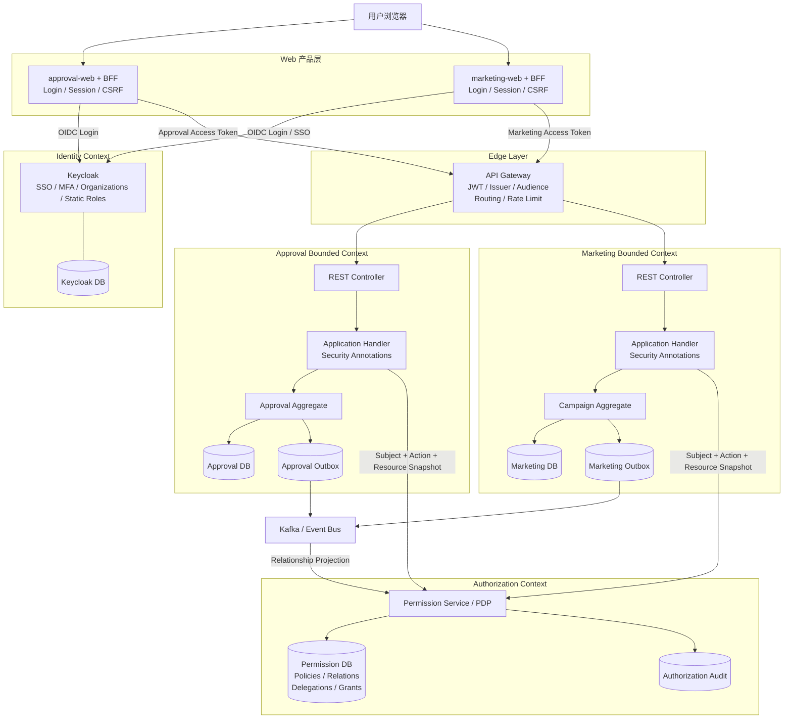
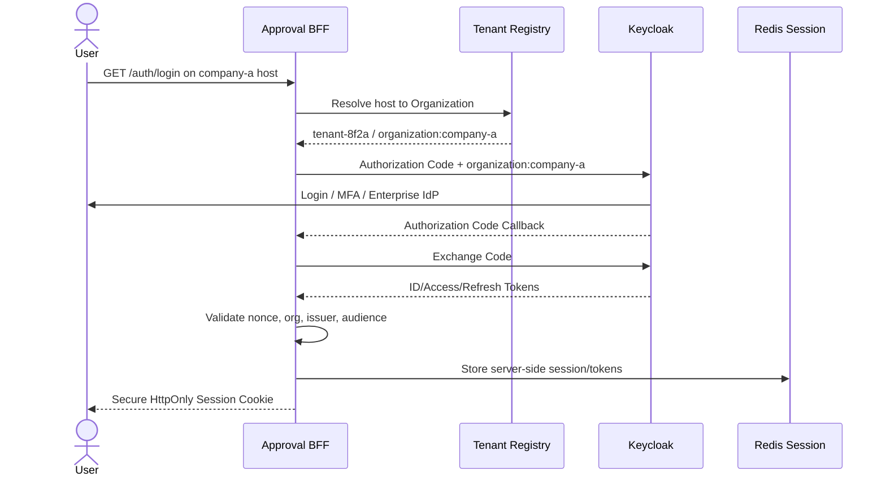
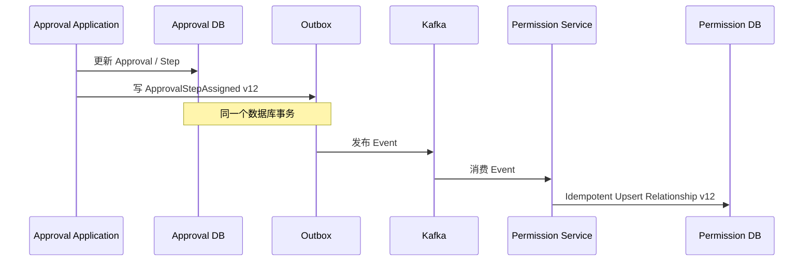

# SaaS 统一身份、SSO、多租户与细粒度授权架构设计

> 适用：Approval System、Marketing System 及后续 SaaS 下游系统
> 推荐栈：Keycloak、Spring Boot/Security、Spring Cloud Gateway、PostgreSQL、Redis、Kafka
> 日期：2026-08-17

专项文档：

- [Keycloak SaaS 多租户结构与自动 Provisioning 设计](./keycloak-saas-multitenant-structure.md)

## 1. 最终方案摘要

本方案采用以下固定决策：

1. 一个 SaaS 平台 Realm，每个客户对应一个 Keycloak Organization。
2. Keycloak 只负责身份、SSO、MFA、Organization、Group 和稳定的静态角色/权限。
3. 每个 Web 产品使用独立 BFF；通过公共 `platform-auth-bff-starter` 复用登录、回调、Session、`/auth/me` 和 Logout。
4. API Gateway 独立部署，只负责 JWT、Issuer、Audience、路由、限流和入口审计。
5. 独立 Permission Service 作为 PDP，负责 RBAC、ABAC、ReBAC、委托和资源级授权。
6. Relationship 通过 Transactional Outbox + Kafka 同步；关键实时 Resource State 在授权请求时由下游提供 Snapshot。
7. Approval、Marketing 各自保持 DDD Bounded Context；各自数据库是业务状态的事实来源。
8. 安全 Annotation 放在 Application Handler；Domain Aggregate 继续保护业务不变量。
9. 所有数据库、缓存、消息、文件和审计必须带可信 `tenant_id`。

职责边界：

```text
Keycloak：用户是谁、属于哪个租户、拥有哪些稳定权限
Gateway：Token 是否可信，是否发给当前 API
Permission Service：用户能否对当前具体资源执行当前动作
Domain：当前业务状态是否允许操作，以及如何改变状态
Database/RLS：最终确保 Tenant 数据隔离
```

## 2. 总体架构



建议域名：

```text
auth.example.com                       Keycloak
company-a.approval.example.com         Approval Web/BFF
company-a.marketing.example.com        Marketing Web/BFF
api.example.com                        API Gateway
```

## 3. 组件职责与数据所有权

| 组件 | 负责 | 不负责 |
|---|---|---|
| Keycloak | 登录、MFA、SSO、Organization、Group、静态角色、Token | Approval/Campaign 状态 |
| Web BFF | OAuth Client、服务端 Token、Web Session、CSRF、Token Relay | 业务授权决策 |
| API Gateway | JWT、Issuer、Audience、路由、限流、Trace | 当前审批人、额度、Campaign 状态 |
| Permission Service | RBAC/ABAC/ReBAC、委托、Grant/Deny、审计 | 用户密码、业务写操作 |
| Approval Service | Approval Use Case、Aggregate、Workflow | Marketing 规则 |
| Marketing Service | Campaign、Brand、Budget、Publish | Approval 规则 |
| Tenant Registry | Tenant 状态、套餐、区域、Keycloak Org 映射 | 密码和业务对象 |
| PostgreSQL/RLS | Tenant 数据隔离 | 登录和 SSO |

### 3.1 Keycloak DB 存什么

```text
Realm、Client、User、Credential、MFA
Organization、Membership、Organization Group
Identity Provider、Client Role、Composite Role
Role Mapping、SSO Session、Service Account
```

其他服务不得直连 Keycloak DB；使用 Admin API、Console、Realm Import 或 IaC。

### 3.2 Permission DB 存什么

```text
Policy Definition / Version
Resource Relationship Projection
Temporary Delegation
Explicit Resource Grant / Deny
Tenant Authorization Configuration
Authorization Decision Audit
Consumed Event ID / Projection Version
```

### 3.3 下游 DB 存什么

Approval DB：申请人、金额、部门、Workflow、当前节点、Assignee、状态、版本、Outbox。
Marketing DB：Campaign、Owner、Brand、Budget、Publish 状态、Approval Reference、版本、Outbox。

## 4. Keycloak SaaS 多租户设计

完整 Keycloak 层级、User/Membership、Client/Role、企业 IdP 和自动 Provisioning 细节参见：[Keycloak SaaS 多租户结构与自动 Provisioning 设计](./keycloak-saas-multitenant-structure.md)。

本方案的结构是：

```text
Keycloak Cluster
└── Keycloak Database
    ├── master Realm（仅平台管理）
    └── saas-platform Realm
        ├── Realm Users（平台级唯一身份）
        ├── Organizations（SaaS Tenants）
        ├── Membership（User ↔ Tenant）
        ├── Organization Groups（Tenant 内组织结构）
        ├── Shared Clients（Approval/Marketing）
        ├── Static Client/Composite Roles
        ├── Client Scopes/Mappers
        └── Realm SSO/Client Sessions
```

Realm 与 Organization 都不是独立数据库。Keycloak DB 只由 Keycloak 管理；业务系统使用 Tenant Registry 将 Keycloak Organization ID 映射为内部 `tenant_id`。

### 4.1 Realm 与 Organization

```text
realm: saas-platform

Organizations:
├── company-a
├── company-b
└── company-c
```

一般 SaaS 使用单 Realm + Organization。只有强监管、独立密钥或物理隔离要求时才使用独立 Realm/部署。

### 4.2 Tenant Registry

Keycloak Organization 是 IAM 对象，业务系统另有内部 Tenant：

```sql
CREATE TABLE tenant (
    tenant_id UUID PRIMARY KEY,
    keycloak_organization_id UUID UNIQUE NOT NULL,
    organization_alias VARCHAR(100) UNIQUE NOT NULL,
    display_name VARCHAR(200) NOT NULL,
    status VARCHAR(30) NOT NULL,
    subscription_plan VARCHAR(50),
    data_region VARCHAR(30),
    created_at TIMESTAMPTZ NOT NULL
);
```

业务数据使用不可变 `tenant_id`，不使用公司显示名称。

### 4.3 Clients

```text
approval-web             Confidential OIDC Client / BFF
approval-api             Approval API Audience
approval-service         Approval Service Account
marketing-web            Confidential OIDC Client / BFF
marketing-api            Marketing API Audience
marketing-service        Marketing Service Account
permission-service       Permission API Audience
tenant-management        Tenant Provisioning Service Account
```

### 4.4 静态 Client Roles

```text
approval.request.create
approval.request.read
approval.request.update
approval.request.submit
approval.request.approve
approval.request.reject
approval.request.audit

marketing.campaign.create
marketing.campaign.read
marketing.campaign.update
marketing.campaign.publish
marketing.campaign.pause
marketing.report.export
```

Composite Role：

```text
approval-approver
├── approval.request.read
├── approval.request.approve
└── approval.request.reject
```

Organization Group 映射：

```text
Company A /FinanceManager → approval-approver
Company A /Marketing      → campaign-editor
Company A /MarketingLead  → campaign-publisher
```

关闭不必要的 Full Scope；Approval Token 只含 Approval 权限且 `aud=approval-api`，Marketing 同理。

### 4.5 Organization 与 Active Tenant Claim

登录请求：

```text
scope=openid profile email organization:company-a
```

Token 示例：

```json
{
  "organization": {
    "company-a": {
      "id": "keycloak-org-30ac",
      "groups": ["/FinanceManager"]
    }
  },
  "tenant_id": "tenant-8f2a",
  "aud": ["approval-api"]
}
```

`tenant_id` 必须由服务端 Tenant Registry 映射生成，不能相信浏览器提交值。一次业务 Session 只有一个 Active Tenant。

### 4.6 Keycloak 最小安全配置基线

`approval-web` / `marketing-web`：

| 设置 | 值 |
|---|---|
| Client type | OpenID Connect |
| Client authentication | On（BFF Confidential Client） |
| Standard flow | On |
| Implicit flow | Off |
| Direct access grants | Off |
| Service accounts | Off |
| PKCE | S256 |
| Valid redirect URIs | 精确 BFF Callback URI |
| Valid post logout URIs | 精确产品 URI |
| Web origins | 精确产品 Origin |
| Full scope allowed | Off |

`approval-api` / `marketing-api`：

- 作为独立 Audience 和 Client Role Namespace。
- 默认关闭 Standard Flow、Implicit Flow 和 Direct Access Grants。
- 不需要服务账号时关闭 Service Accounts。
- 配置 Audience Mapper，使对应 Web/BFF Token 只获得目标 API Audience。

`approval-service` / `marketing-service`：

| 设置 | 值 |
|---|---|
| Client authentication | On |
| Service accounts | On |
| Standard flow | Off |
| Direct access grants | Off |
| Client secret/private key | 存 Vault/Secret Manager，不进 Git |

Realm/Organization：

- 开启 Organizations，并在 Organization Mapper 中包含 Organization ID。
- 需要时加入 Organization Group Membership Mapper 和 Group Role Mapping。
- 设置 Session Idle/Max、MFA、Brute-force Detection 和安全事件审计。
- 为管理操作使用最小化 Admin Role，不向租户管理员授予 Realm-wide Admin。

## 5. Web 登录、BFF 与 SSO

### 5.1 公共 Auth BFF Starter

建立：

```text
platform-auth-bff-spring-boot-starter
```

统一实现：

```text
Authorization Code Flow、PKCE/state/nonce
Dynamic Organization Scope、Callback
Organization Claim Validation、Tenant Mapping
Server-side Redis Session、/auth/me
Local/OIDC Logout、CSRF、Token Relay
```

只有用户访问的 Web/BFF 需要这些入口；纯 API 不需要。

### 5.2 统一入口

```text
GET  /auth/login
GET  /auth/me
POST /auth/logout
GET  /login/oauth2/code/keycloak  Keycloak 回调，Spring Security 自动处理
```

Spring Security 默认登录发起路径为 `/oauth2/authorization/keycloak`。`/auth/login` 是 Starter 的友好入口。

### 5.3 登录时序



### 5.4 SSO 语义

Approval 和 Marketing 各有自己的 Application Session，但共享 Keycloak Realm SSO Session：

```text
首次 Approval：Keycloak 登录/MFA
随后 Marketing：重定向 Keycloak，因已有 SSO Cookie 而直接返回 Code
```

SSO 不等于共享 Access Token，也不等于共享应用 Cookie。

### 5.5 Session 配置

```yaml
spring:
  session:
    store-type: redis

server:
  servlet:
    session:
      cookie:
        http-only: true
        secure: true
        same-site: lax
```

使用 Host-only Cookie，不设置宽泛的 `.example.com` Cookie Domain。Redis 保存 Session 与 Token，并设置 TTL 和网络隔离。

### 5.6 Approval BFF 配置

```yaml
platform:
  auth:
    application: approval
    client-id: approval-web
    api-audience: approval-api
    organization-resolution: subdomain
    post-login-path: /
    post-logout-path: /

spring:
  security:
    oauth2:
      client:
        registration:
          keycloak:
            client-id: approval-web
            client-secret: ${APPROVAL_WEB_CLIENT_SECRET}
            authorization-grant-type: authorization_code
            redirect-uri: "{baseUrl}/login/oauth2/code/{registrationId}"
            scope: openid,profile,email
        provider:
          keycloak:
            issuer-uri: https://auth.example.com/realms/saas-platform
```

Marketing 只替换 Application、Client 和 Audience 配置，不重复 Auth 代码。

### 5.7 `/auth/me`

```json
{
  "authenticated": true,
  "user": {
    "id": "user-alice",
    "name": "Alice",
    "email": "alice@company-a.com"
  },
  "tenant": {
    "id": "tenant-8f2a",
    "alias": "company-a",
    "name": "Company A"
  },
  "application": "approval",
  "permissions": [
    "approval.request.read",
    "approval.request.approve"
  ]
}
```

前端用它控制 UI；后端仍重新授权。

## 6. API Gateway

Java/Spring 团队推荐独立 Spring Cloud Gateway；也可使用 Kong、Envoy、NGINX 或云 Gateway。

Gateway 无业务数据库，负责：

```text
JWT Signature、Issuer、Audience、Expiry
Routing、Rate Limiting、CORS、Request Limit
Trace/Correlation ID、粗粒度 Endpoint Protection
```

路由：

```yaml
spring:
  cloud:
    gateway:
      routes:
        - id: approval-api
          uri: http://approval-api
          predicates:
            - Path=/api/approval/**
        - id: marketing-api
          uri: http://marketing-api
          predicates:
            - Path=/api/marketing/**
```

规则：

```text
/api/approval/**  → aud includes approval-api
/api/marketing/** → aud includes marketing-api
```

BFF 从 Session 获取 Token；Gateway Token Relay；下游再次本地验证 JWT。Gateway 不判断当前审批人或 Campaign 状态。

## 7. 下游 Resource Server

Approval：

```yaml
spring:
  security:
    oauth2:
      resourceserver:
        jwt:
          issuer-uri: https://auth.example.com/realms/saas-platform
          audiences:
            - approval-api
```

公共组件：

```text
platform-resource-server-starter
├── JwtAuthenticationConverter
├── CallerContextProvider / TenantContext
├── Permission Annotations
├── Authorization Interceptor
├── ResourceSnapshotProvider SPI
├── PermissionServiceClient
└── Standard Error Handling
```

## 8. Permission Service

### 8.1 定义

Permission Service 是内部 PDP，只回答：

> Subject 是否可以在当前 Tenant，对指定 Resource 执行指定 Action？

它不处理登录、不签发 Token、不保存密码、不执行业务写操作。

```text
Decision = f(Subject, Tenant, Action, Resource, Context, Policy)
```

### 8.2 API Contract

```http
POST /internal/v1/authorize
Authorization: Bearer <original-user-access-token>
mTLS client identity: approval-service
```

生产环境建议同时验证两种身份：

```text
mTLS / Service Mesh Identity：谁在调用 Permission Service
Bearer JWT：代表哪个用户/服务主体进行授权
```

Permission Service 自己验证 Bearer JWT 的签名、Issuer、Audience、Tenant 和权限，并从 JWT 派生 Subject。它不能信任请求 Body 中调用方自行填写的 `roles`、`permissions` 或 `tenantId`。

如果没有 mTLS，可以使用 Token Exchange，取得 `aud=permission-service` 且保留 Subject/Actor 语义的 Token。纯后台任务则使用 Client Credentials Token。

```json
{
  "action": "approval.request.approve",
  "resource": {
    "type": "approval-request",
    "id": "REQ-100",
    "tenantId": "tenant-8f2a",
    "version": 12,
    "attributes": {
      "status": "PENDING_APPROVAL",
      "requesterId": "bob",
      "amount": 50000,
      "departmentId": "finance",
      "currentStep": 2,
      "currentApproverId": "alice"
    }
  },
  "context": {
    "application": "approval-api",
    "traceId": "trace-123",
    "callerService": "approval-service"
  }
}
```

Permission Service 验证 JWT 后，在内部构造：

```json
{
  "subject": {
    "id": "alice",
    "tenantId": "tenant-8f2a",
    "roles": ["approval-approver"],
    "permissions": ["approval.request.approve"],
    "groups": ["finance-manager"]
  }
}
```

```json
{
  "allowed": true,
  "decisionId": "decision-123",
  "policyId": "approval-approve-policy",
  "policyVersion": 7,
  "reasonCode": "CURRENT_ASSIGNED_APPROVER"
}
```

### 8.3 Permission DB 核心表

```text
authorization_policy
resource_relationship
delegation
resource_grant
authorization_decision_audit
consumed_event
```

示例 Relationship：

```text
tenant-8f2a | approval-request | REQ-100 | assigned-approver | USER  | alice | v12
tenant-8f2a | campaign         | CMP-200 | editor            | GROUP | marketing-apac | v8
```

Delegation：

```text
Bob → Alice → approval.request.approve
valid from 2026-08-17 to 2026-08-20
```

### 8.4 决策优先级

```text
1. 默认 DENY
2. Tenant 不一致立即 DENY
3. 显式 DENY 高于 ALLOW
4. 必须包含基础静态 Permission
5. Snapshot 必须符合实时状态
6. Relationship/Delegation 必须有效
7. Policy 条件全部满足才 ALLOW
8. PDP 不可用时不执行受保护写操作
```

## 9. Relationship 事件同步与实时 Snapshot

### 9.1 为什么使用两种数据来源

Relationship 适合表达并索引：

```text
Alice assigned-approver REQ-100
FinanceManager approver-group REQ-100
Alice editor CMP-200
MarketingAPAC editor Brand-APAC
Bob delegated-to Alice
```

Snapshot 适合提供请求时的实时状态：

```text
status、requesterId、amount、currentApproverId
currentStep、budgetStatus、aggregateVersion
```

Permission Service 不应直连每个业务数据库：

```text
Relationship：事件异步投影，用于快速关系查询
Snapshot：下游授权请求时提供，用于实时状态判断
```

### 9.2 Transactional Outbox

Approval Service 在同一数据库事务：

```text
1. 更新 Approval Aggregate
2. 写入 Outbox Event
3. Commit
```

```json
{
  "eventId": "evt-123",
  "eventType": "ApprovalStepAssigned",
  "tenantId": "tenant-8f2a",
  "aggregateId": "REQ-100",
  "aggregateVersion": 12,
  "occurredAt": "2026-08-17T10:00:00Z",
  "payload": {
    "step": 2,
    "assigneeType": "USER",
    "assigneeId": "alice"
  }
}
```

Outbox Relay 发布 Kafka；Permission Consumer 幂等更新 Relationship Projection。



### 9.3 Source of Truth

```text
Approval DB：审批状态、节点、当前审批人的事实来源
Marketing DB：Campaign、Brand、Budget、Publish 状态的事实来源
Permission Relationship：可从事件重建的授权查询 Projection
Permission Policy/Delegation：Authorization Context 自己的事实来源
```

Permission DB 不能变成第二套 Approval/Marketing DB。

### 9.4 Event Lag 与撤权风险

可能出现：

```text
Approval DB 已到 version 13
Permission Relationship 仍在 version 12
```

高风险写操作采用以下策略：

1. Snapshot 携带 `aggregateVersion`、`currentApproverId` 和状态。
2. Relationship 携带 `sourceVersion`。
3. 关系版本落后且规则依赖该关系时，默认拒绝。
4. 当前审批人等关键事实以实时 Snapshot 为准。
5. Consumer 使用 `eventId` 幂等，旧版本不能覆盖新版本。
6. 删除/撤权发布明确 Tombstone/Revocation Event。
7. 失败进入 DLQ，并支持从 Event Log Replay。

### 9.5 策略示例

```text
ALLOW approval.request.approve 当且仅当：

Token 包含 approval.request.approve
AND Subject Tenant == Resource Tenant
AND Snapshot.status == PENDING_APPROVAL
AND Snapshot.requesterId != Subject.id
AND (
    Snapshot.currentApproverId == Subject.id
    OR Relationship/Delegation 允许 Subject 代理
)
AND Subject.approvalLimit >= Snapshot.amount
AND 没有显式 DENY
```

## 10. Security Annotation

### 10.1 定义与用途

```text
@RequireTenantAccess
URL/Command Tenant 必须等于已验证 Token Tenant

@RequirePermissions
没有具体 Resource 的静态功能权限

@RequireResourcePermission
具体 Resource 动态权限，并隐含基础 Permission 检查
```

创建资源：

```java
@RequireTenantAccess(tenantId = "#command.tenantId.value")
@RequirePermissions("approval.request.create")
public ApprovalId handle(CreateApprovalCommand command) {
    // Resource 尚不存在
}
```

审批资源：

```java
@RequireTenantAccess(tenantId = "#command.tenantId.value")
@RequireResourcePermission(
    action = "approval.request.approve",
    resourceType = "approval-request",
    resourceId = "#command.approvalId.value"
)
@Transactional
public void handle(ApproveRequestCommand command) {
    // PDP 同时检查基础 Permission 与资源规则
}
```

### 10.2 放置位置

Annotation 放在 Application Handler，而不是只放 Controller：

```text
REST Controller ─┐
GraphQL          ├→ Application Handler → Domain
Kafka Consumer   │
Scheduler        ┘
```

Controller 可增加粗粒度快速拒绝，但 Application Handler 是授权主边界。

## 11. DDD 实现结构

### 11.1 Bounded Context

```text
Identity Context           Keycloak
Tenant Management Context  Tenant、套餐、Organization 映射
Authorization Context      Permission、Policy、Relationship、Delegation
Approval Context           Approval、Workflow、Approval Step
Marketing Context          Campaign、Brand、Budget、Publishing
```

### 11.2 Approval 目录

```text
approval-service
└── src/main/java/com/example/approval
    ├── interfaces/rest
    │   └── ApprovalController
    ├── application
    │   ├── command/ApproveRequestCommand
    │   ├── command/ApproveRequestHandler
    │   └── port
    │       ├── CurrentActorPort
    │       ├── AuthorizationPort
    │       └── EventPublisherPort
    ├── domain/approval
    │   ├── Approval
    │   ├── ApprovalStep
    │   ├── ApprovalStatus
    │   ├── ApprovalRepository
    │   ├── ApprovalId
    │   └── ApprovalCompleted
    └── infrastructure
        ├── security
        │   ├── KeycloakActorAdapter
        │   ├── PermissionServiceAdapter
        │   └── ApprovalSnapshotProvider
        ├── persistence/JpaApprovalRepositoryAdapter
        └── messaging
            ├── OutboxRelay
            └── KafkaEventPublisher
```

依赖：

```text
Interfaces → Application → Domain
Infrastructure → implements Application/Domain Ports
```

Domain 不依赖 Keycloak、JWT、Spring Security、HTTP、JPA、Kafka 或 Permission Service。

### 11.3 Controller

```java
@RestController
public class ApprovalController {

    private final ApproveRequestHandler handler;

    @PostMapping("/tenants/{tenantId}/requests/{requestId}/approve")
    public ResponseEntity<Void> approve(
        @PathVariable UUID tenantId,
        @PathVariable UUID requestId
    ) {
        handler.handle(new ApproveRequestCommand(
            new TenantId(tenantId),
            new ApprovalId(requestId)
        ));
        return ResponseEntity.noContent().build();
    }
}
```

### 11.4 Application Handler

```java
@Service
public class ApproveRequestHandler {

    private final ApprovalRepository repository;
    private final CurrentActorPort currentActor;

    @RequireTenantAccess(tenantId = "#command.tenantId.value")
    @RequireResourcePermission(
        action = "approval.request.approve",
        resourceType = "approval-request",
        resourceId = "#command.approvalId.value"
    )
    @Transactional
    public void handle(ApproveRequestCommand command) {
        Actor actor = currentActor.current();
        Approval approval = repository.findForUpdate(
            command.tenantId(), command.approvalId()
        ).orElseThrow(ApprovalNotFound::new);

        approval.approve(actor.userId());
        repository.save(approval);
    }
}
```

### 11.5 Domain Aggregate

```java
public class Approval {

    public void approve(UserId actorId) {
        if (status != ApprovalStatus.PENDING_APPROVAL) {
            throw new InvalidApprovalStatus();
        }
        if (requesterId.equals(actorId)) {
            throw new SelfApprovalNotAllowed();
        }

        ApprovalStep current = currentStep();
        if (!current.isAssignedTo(actorId)) {
            throw new ActorNotAssignedToStep();
        }

        current.approve(actorId);
        if (allRequiredStepsApproved()) {
            status = ApprovalStatus.APPROVED;
            registerEvent(new ApprovalCompleted(id, tenantId, actorId));
        }
    }
}
```

PDP 提前授权；Aggregate 最终保证非法状态不能写入。

## 12. 完整审批请求流程

```mermaid
sequenceDiagram
    actor U as Alice
    participant B as Approval BFF
    participant G as API Gateway
    participant S as Spring Security
    participant H as ApproveRequestHandler
    participant D as Approval DB
    participant P as Permission Service
    participant PD as Permission DB
    participant A as Approval Aggregate
    participant O as Outbox

    U->>B: POST approve with Session Cookie
    B->>B: CSRF + Session + Token Refresh
    B->>G: Bearer Approval Access Token
    G->>G: JWT / issuer / audience / route
    G->>S: Forward request
    S->>S: Validate JWT; build CallerContext
    S->>H: Invoke Handler
    H->>H: RequireTenantAccess
    H->>D: Load tenant-scoped Resource Snapshot
    D-->>H: REQ-100 Snapshot v12
    H->>P: Authorize Subject + Action + Snapshot
    P->>PD: Policy + Relationship + Delegation
    PD-->>P: Authorization data
    P-->>H: ALLOW decision-123
    H->>D: SELECT FOR UPDATE by tenant + id
    D-->>H: Approval Aggregate
    H->>A: approve(Alice)
    A->>A: Validate invariants
    H->>D: Save Aggregate
    H->>O: Save Domain Event in same transaction
    H-->>B: 204 No Content
    B-->>U: 204 No Content
```

## 13. 多租户数据隔离

所有表包含 Tenant，并将 Tenant 纳入主键/唯一键：

```sql
CREATE TABLE approval_request (
    tenant_id UUID NOT NULL,
    approval_id UUID NOT NULL,
    requester_id VARCHAR(200) NOT NULL,
    status VARCHAR(30) NOT NULL,
    amount NUMERIC(18,2),
    version BIGINT NOT NULL,
    PRIMARY KEY (tenant_id, approval_id)
);
```

Repository 只提供：

```text
findByTenantIdAndId(...)
findForUpdate(tenantId, id)
```

建议启用 PostgreSQL RLS：

```sql
ALTER TABLE approval_request ENABLE ROW LEVEL SECURITY;

CREATE POLICY tenant_isolation
ON approval_request
USING (tenant_id = current_setting('app.tenant_id')::uuid);
```

Tenant 还必须覆盖：

```text
Redis keys、Kafka messages、S3 paths、Search indexes
Scheduled jobs、Audit logs、Idempotency keys、Metrics
```

示例：

```text
Redis: tenant:{tenantId}:approval:{approvalId}
S3:    tenants/{tenantId}/approval/{fileId}
Kafka: { tenantId, aggregateId, eventId, version }
```

## 14. 服务间调用

首选事件：

```text
ApprovalCompleted → Kafka → Marketing Consumer
```

```json
{
  "eventId": "evt-500",
  "tenantId": "tenant-8f2a",
  "approvalId": "REQ-100",
  "campaignId": "CMP-200",
  "actorId": "alice",
  "aggregateVersion": 14
}
```

同步调用使用 Client Credentials：

```text
approval-service token
aud = marketing-api
role = marketing.approval.callback
```

需要用户委托上下文时使用受控 Token Exchange。不要把 `aud=approval-api` Token 原样转发给 Marketing。

## 15. Tenant Onboarding

### 15.1 自动化决策

标准 SaaS Tenant 默认全自动 Provisioning。用户只提交创建 Tenant 的业务请求；`tenant-management-service` 使用专用 Service Account 和 Keycloak Admin API 自动创建 Organization、Owner Membership、默认 Groups/Roles，并初始化 Permission、Approval 和 Marketing。

企业 IdP、Domain Ownership、SAML/OIDC Metadata、证书和高权限管理变更可以进入半自动审批。用户和下游服务不得直接写 Keycloak DB，也不得获得 Keycloak Realm Admin 权限。

```text
POST /tenants + Idempotency-Key
→ Tenant Registry(PROVISIONING)
→ Transactional Outbox
→ Provisioning Saga/Worker
→ Keycloak Admin API
→ Permission/Approval/Marketing initialization
→ Tenant ACTIVE
→ BFF requests organization:new-alias Token
```

Tenant 状态至少包含：

```text
PENDING_VALIDATION
PROVISIONING
ACTIVE
PROVISIONING_FAILED
SUSPENDED
DEPROVISIONING
DELETED
```

创建 API 返回 `202 Accepted + operationId`；前端查询 Operation 状态。每个 Saga Step 必须幂等并记录外部 Resource ID、Attempt 和 Error。Keycloak 已创建但后续失败时优先 Disable/Retry，不立即执行破坏性删除。

### 15.2 Provisioning Steps

```text
1. Tenant Management 创建内部 tenant_id
2. 通过 Keycloak Admin API 创建 Organization
3. 保存 tenant_id ↔ keycloak_organization_id 映射
4. 配置 Organization Domain
5. 可选连接客户 Entra ID / Okta / SAML IdP
6. 创建 Organization Groups
7. 映射 Composite Roles
8. 邀请 Organization Admin
9. 初始化 Permission Policy
10. 初始化 Approval/Marketing Tenant 数据
11. 发布 TenantProvisioned Event
```

这是跨系统 Saga，不使用跨数据库事务。Provisioning 完成后旧 Token 不会自动包含新 Membership，BFF 应重新请求 `scope=organization:<new-alias>`；Keycloak 会复用现有 SSO Session，通常不要求用户重新输入密码。

完整 Saga、幂等、Domain/IdP 验证、失败补偿和 Reconciliation 设计参见：[Keycloak SaaS 多租户结构与自动 Provisioning 设计](./keycloak-saas-multitenant-structure.md)。

## 16. 错误与 Fail-Closed

| 场景 | HTTP | 行为 |
|---|---:|---|
| Token 缺失/无效 | 401 | 不进入业务 |
| Issuer/Audience 错误 | 401 | 不进入业务 |
| Tenant 不匹配 | 403 | 安全审计 |
| 当前 Tenant 找不到资源 | 404 | 防止跨租户枚举 |
| 缺少静态 Permission | 403 | 拒绝 |
| PDP Policy 拒绝 | 403 | 详细原因只进内部审计 |
| PDP 不可用 | 503 | 写操作不执行 |
| Aggregate Version 冲突 | 409 | 客户端刷新 |

## 17. 缓存、性能与高可用

### JWT

- 使用 Keycloak JWKS 本地验签，不要每请求调用 Introspection。
- JWKS 自动缓存/轮换。
- Access Token 短生命周期；Refresh Token 只在 BFF。

### Decision Cache

缓存键至少包含：

```text
tenantId、subjectId、action、resourceType、resourceId
resourceVersion、policyVersion
```

审批、发布、删除等写操作不缓存或极短 TTL。Resource/Policy Version 变化使旧结果失效。

### Resilience

- Permission Service 多副本无状态部署。
- Permission DB 高可用。
- Kafka Consumer 可重放。
- PDP 严格超时、有限重试、熔断。
- 写操作无法确认授权时拒绝。

## 18. 审计与可观测性

记录：

```text
decisionId、traceId、tenantId、subjectId、serviceIdentity
application、action、resourceType、resourceId、resourceVersion
policyId、policyVersion、allowed、reasonCode、decidedAt、latencyMs
```

不得把 Access Token、Refresh Token、Client Secret 或密码写入日志。

## 19. 公共平台组件

### `platform-auth-bff-starter`

```text
OIDC Login、Dynamic Organization Scope、Callback
Organization Validation、Tenant Mapping、Redis Session
/auth/me、OIDC Logout、CSRF、Token Relay
```

### `platform-resource-server-starter`

```text
JWT/Audience Validation、Keycloak Role Converter
CallerContext、TenantContext、Security Annotations
ResourceSnapshotProvider SPI、PermissionServiceClient
统一 401/403/404/503、Audit/Trace
```

### 新系统接入

```text
1. 创建 finance-web / finance-api / finance-service Clients
2. 配置精确 Redirect URI
3. 定义 finance.* 静态权限
4. 引入两个 Starter
5. 填 application.yml
6. 配置 Gateway Route/Audience
7. 实现 ResourceSnapshotProvider
8. 定义 Permission Policies
9. 发布 Relationship Domain Events
10. 添加 Tenant/RLS/Authorization 测试
```

## 20. 实施路线图

### Phase 1：Identity 与 SSO

- 创建 `saas-platform` Realm，开启 Organizations。
- 建立 Approval/Marketing Clients、Roles 和 Composite Roles。
- 实现 `platform-auth-bff-starter`。
- 验证 Approval → Marketing SSO。

### Phase 2：Tenant 与 Gateway

- Tenant Registry 和 Organization 映射。
- 部署 Gateway；配置 JWT、Issuer、Audience、Route。
- 下游启用 Resource Server。
- 数据库加入 Tenant Key 和 RLS。

### Phase 3：Permission Service MVP

- `/internal/v1/authorize`。
- Policy、Relationship、Delegation、Grant/Deny、Audit。
- 初期使用明确 Java Policy，不急于自研通用 DSL。

### Phase 4：Event Projection

- Transactional Outbox、Kafka。
- Consumer 幂等、Version、DLQ、Replay。

### Phase 5：DDD 与 Security Starter

- 三个 Annotation、Snapshot SPI、PDP Client。
- Annotation 放 Application Handler。
- Aggregate 保护业务不变量。
- 架构测试确保公开 Handler 有授权策略。

### Phase 6：强化

- 委派管理、Policy 模拟/版本、Break-glass。
- 缓存失效、HA/DR、密钥轮换、渗透测试。

## 21. 测试清单

### Identity/SSO

- 首次 Approval 登录需要 MFA；随后 Marketing 自动 SSO。
- Approval Token 不能调用 Marketing API。
- 用户不能请求不属于自己的 Organization。
- Local/Global Logout 行为符合设计。

### Tenant

- Company A Token 不能访问 Company B URL/Resource。
- 所有 Repository 查询包含 Tenant。
- RLS 在应用遗漏时仍拒绝。
- Redis、Kafka、S3、Audit 均携带 Tenant。

### Permission

- 无基础 Permission 拒绝。
- 非当前审批人、自我审批拒绝。
- 委托有效期正确。
- Explicit Deny 高于 Allow。
- Relationship 版本落后时高风险写操作拒绝。
- PDP 超时/不可用时写操作不执行。

### Domain/Event

- 非待审批状态不能审批。
- Aggregate Version 冲突返回 409。
- Aggregate 和 Outbox 同事务提交。
- 重复 Event 不产生重复关系。

### Security

- Redirect URI 精确匹配。
- Cookie 为 HttpOnly/Secure/SameSite。
- CSRF 保护修改和 Logout。
- 外部身份 Header 被清理。
- 日志不包含 Token/Secret/密码。

## 22. 最终决策速查

| 问题 | 最终选择 |
|---|---|
| SaaS Tenant | 单 Realm + Organization per Tenant |
| Web 登录 | BFF + Authorization Code Flow |
| Auth 代码复用 | `platform-auth-bff-starter` |
| SSO | Keycloak Realm SSO Session |
| Web Session | 每产品独立 Redis Session |
| Gateway | 独立 Spring Cloud Gateway |
| 静态权限 | Keycloak Client/Composite Roles |
| 动态权限 | 独立 Permission Service/PDP |
| Relationship | Domain Event + Outbox + Kafka Projection |
| 实时状态 | 请求时 Resource Snapshot |
| 授权主边界 | Application Handler Annotation |
| 业务不变量 | Domain Aggregate |
| Tenant 最终隔离 | Tenant Repository + PostgreSQL RLS |
| 服务集成 | 优先 Event；同步用 Client Credentials/Token Exchange |
| Keycloak DB | 只由 Keycloak 管理，其他服务不直连 |

最终链路：

```text
Browser
→ Product BFF
→ Keycloak SSO
→ Product-specific Access Token
→ API Gateway
→ Resource Server JWT Validation
→ Application Handler Annotation
→ Tenant-scoped Resource Snapshot
→ Permission Service PDP
→ Domain Aggregate
→ Tenant-scoped DB/RLS
→ Transactional Outbox
→ Kafka
→ Permission Relationship Projection
```

## 23. 官方参考

- [Keycloak Server Administration Guide](https://www.keycloak.org/docs/latest/server_admin/)
- [Keycloak Organizations](https://www.keycloak.org/docs/latest/server_admin/#managing-organizations)
- [Keycloak OIDC Endpoints](https://www.keycloak.org/securing-apps/oidc-layers)
- [Keycloak Authorization Services](https://www.keycloak.org/docs/latest/authorization_services/index.html)
- [Keycloak Admin REST API](https://www.keycloak.org/docs-api/latest/rest-api/index.html)
- [Spring Security OAuth2 Login](https://docs.spring.io/spring-security/reference/servlet/oauth2/login/index.html)
- [Spring Security OAuth2 Login Advanced](https://docs.spring.io/spring-security/reference/servlet/oauth2/login/advanced.html)
- [Spring Security JWT Resource Server](https://docs.spring.io/spring-security/reference/servlet/oauth2/resource-server/jwt.html)
- [Spring Security Method Security](https://docs.spring.io/spring-security/reference/servlet/authorization/method-security.html)
- [Spring Cloud Gateway Token Relay](https://docs.spring.io/spring-cloud-gateway/reference/spring-cloud-gateway-server-webmvc/filters/tokenrelay.html)
